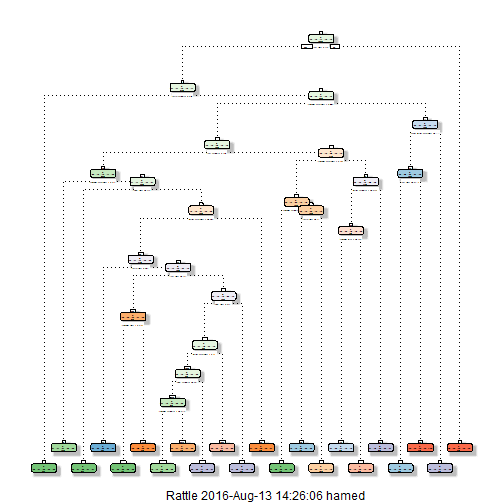

#Overview & Summary: 
One thing that people regularly do is quantify how much of a particular activity they do, but they rarely quantify how well they do it. In this project, we use data from accelerometers on the belt, forearm, arm, and dumbell of 6 participants. They were asked to perform barbell lifts correctly and incorrectly in 5 different ways. The goal of this project is to predict the manner in which they did the exercise. This is the "classe" variable in the training set.We applied classification Trees and Random Forest model on these data and results show that Random forest is a better fit with 99% out of sample accuarcy power.

#Loading data
Load the project data and perform some basic exploratory data analyses

```r
setwd("C:/Users/hamed/Desktop/Data Science/Working Directory")
#traindownloadPath <- "https://d396qusza40orc.cloudfront.net/predmachlearn/pml-training.csv"
#testdownloadPath <- "https://d396qusza40orc.cloudfront.net/predmachlearn/pml-testing.csv"
#Downloading the required data
#download.file(traindownloadPath,destfile="./pml-training.csv")
#download.file(testdownloadPath,destfile="./pml-testing.csv")
# Read files of subjects
rm(list=ls())
Trainingsetorig <- read.csv("./pml-training.csv",sep=",", stringsAsFactors=FALSE,na.strings = c("NA", ""))
Testingsetorig <- read.csv("./pml-testing.csv",sep=",", stringsAsFactors=FALSE, na.strings = c("NA", ""))
```

### Data Cleansing
here we load data and do some cleansing on the data, remove the data variables which have null values.


```r
#removing all the missing and NA values
Trainingset<-Trainingsetorig
Testingset<-Testingsetorig
Trainingset<-Trainingset[ , colSums(is.na(Trainingset)) == 0]
Testingset<-Testingset[ , colSums(is.na(Testingset)) == 0]
#finding the index of output column
Trainclassecolnum<- which( colnames(Trainingset)=="classe" )
#removing class column from data as well
# we remove the fisrt 7 columns as they are informative and it does not seem they have information required for predictions
Trainingset<-Trainingset[,-(1:7)]
Testingset<-Testingset[,-(1:7)]
```

### Decompising Training data set into subtranining and validation data sets 
In order to be able to do some cross validation and check the performance of the model and also provide some estimation on the out-of-sample prediction error, we decompose the training data set into 2 sub parts, Subtraining 60% and validation 40% sets.


```r
library(caret)
```

```
## Loading required package: lattice
```

```
## Loading required package: ggplot2
```

```r
set.seed(4321) 
subtrainIndex <- createDataPartition(Trainingset$classe, p = 0.6, list = FALSE)
subtraining = Trainingset[subtrainIndex, ]
validation = Trainingset[-subtrainIndex, ]
```

### Cross validation 
for cross validation approaches, there are three approaches 1-random subsampling 2-k-fold 3-leave one out. we use k-fold for cross validation. in this approach we break training set into K subsets. then we build the model on the remaining tarining data in each subset and applied to the test subset. Then rebuild the data K times with the training and test subsets and average the findings.we build 9 models for k=2:10 to chose the one which has lower out of sample error.

### Prediction model buildings
we are going to use to different models: 
1-Prediction with Classification Tress : use interaction between variables 
2-Prediction with Random Forests

###Constructing Trees

```r
library(rpart)
library(rpart.plot)
library(e1071)
k=10
fold<-as.data.frame(matrix(rep(0,times=2),nrow=1))
accuracy<-as.data.frame(matrix(rep(0,times=k-1),nrow=k-1))

for (j in (2:k))
{
    
folds<-createFolds(y=subtraining$classe,k=j,list = TRUE,returnTrain = TRUE)
for (i in (1:j))
{
 tree <- rpart(classe ~ ., data=subtraining[folds[[i]],], method="class")
 treepred<-predict(tree,newdata =subtraining[-folds[[i]],] ,type = "class") 
 newdata<-subtraining[-folds[[i]],]
 fold[1,i]=sum(treepred==newdata$classe)/length(treepred)
}
#calculationg mean of accuracy on all the k folds of a specific fols
accuracy[j-1,1]<-apply(fold[1,],1,mean)
}
accuracy
```

```
##          V1
## 1 0.7180707
## 2 0.7317428
## 3 0.7206210
## 4 0.7346325
## 5 0.7366699
## 6 0.7352265
## 7 0.7347148
## 8 0.7340308
## 9 0.7366657
```

the results for different number of folds shows that k=5 has the highest accuracy so we run the final model for k=5 and apply the validation data on it to calculate out of sample prediction accuray and error.


```r
library(rattle)
```

```
## Rattle: A free graphical interface for data mining with R.
## Version 4.1.0 Copyright (c) 2006-2015 Togaware Pty Ltd.
## Type 'rattle()' to shake, rattle, and roll your data.
```

```r
folds<-createFolds(y=subtraining$classe,k=5,list = TRUE,returnTrain = TRUE)
treemodel <- rpart(classe ~ ., data=subtraining, method="class")
treepred<-predict(tree,newdata =validation,type = "class" ) 
accuracy=sum(treepred==validation$classe)/length(treepred)
accuracy
```

```
## [1] 0.7113179
```

```r
fancyRpartPlot(treemodel)
```

```
## Warning: labs do not fit even at cex 0.15, there may be some overplotting
```



as we see, the accuracy of the validation set prediction 71.1% which is not good enough for prediction so we apply random forests on the data as well.

###Random Forests
here we apply the random forest on the data. In order to prepare the folded data for prediction, we use the trainControl command. The function trainControl generates parameters that further control how models are created. 


```r
k=5
library(randomForest)
```

```
## randomForest 4.6-12
```

```
## Type rfNews() to see new features/changes/bug fixes.
```

```
## 
## Attaching package: 'randomForest'
```

```
## The following object is masked from 'package:ggplot2':
## 
##     margin
```

```r
library(repmis)
traindatacontrol <- trainControl( number = k, method = "cv")
rfmodel<-train(classe ~ ., data = subtraining, method = "rf",trControl = traindatacontrol)
# here we apply the model to the validation data set 
rfpred <- predict(rfmodel, validation)
# Show prediction result
finalrf<-confusionMatrix(rfpred,validation$classe)
finalrf$overall
```

```
##       Accuracy          Kappa  AccuracyLower  AccuracyUpper   AccuracyNull 
##      0.9929901      0.9911316      0.9908853      0.9947149      0.2844762 
## AccuracyPValue  McnemarPValue 
##      0.0000000            NaN
```

```r
#this is the model
rfmodel
```

```
## Random Forest 
## 
## 11776 samples
##    52 predictor
##     5 classes: 'A', 'B', 'C', 'D', 'E' 
## 
## No pre-processing
## Resampling: Cross-Validated (5 fold) 
## Summary of sample sizes: 9421, 9422, 9421, 9420, 9420 
## Resampling results across tuning parameters:
## 
##   mtry  Accuracy   Kappa    
##    2    0.9892159  0.9863568
##   27    0.9884515  0.9853895
##   52    0.9817428  0.9769024
## 
## Accuracy was used to select the optimal model using  the largest value.
## The final value used for the model was mtry = 2.
```

```r
plot(finalrf$table,main="Predicted classes Vs Actual classes " )
```


the results of the Random Forest model shows that we have an accuracy around 98.9% for out of sample prediction accuracy or around 1.1% out of sample error which is a really good result.
 here we apply the model on the testing data:
 

```r
 testpred<-predict(rfmodel, Testingset)
testpred
```

```
##  [1] B A B A A E D B A A B C B A E E A B B B
## Levels: A B C D E
```
these are the results of the predicted values for the testing set.
